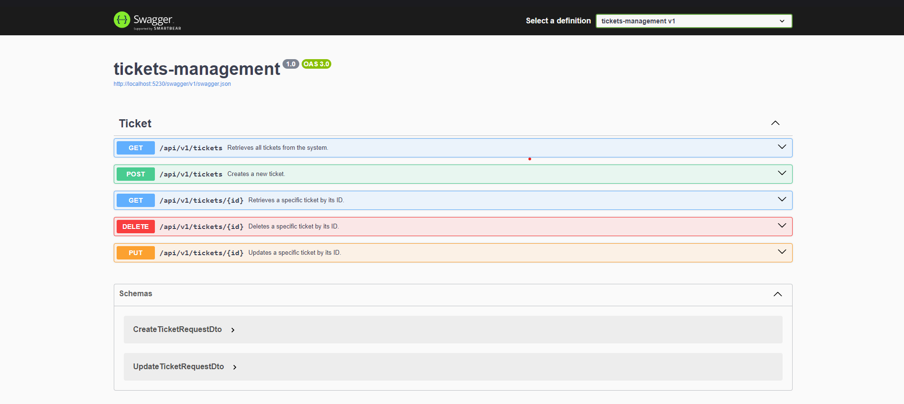
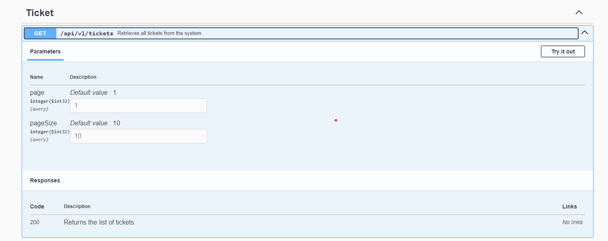

# Application Setup Guide

This guide will walk you through the steps to set up and run the web application, which is built with **.NET 8** for the backend and a **TypeScript-based frontend framework** (Angular or React). The application allows users to manage tickets with CRUD functionality.

## Prerequisites

Before setting up the project, ensure the following tools are installed on your machine:

- [.NET 8 SDK](https://dotnet.microsoft.com/download/dotnet/8.0)
- [Node.js (version 14.x or later)](https://nodejs.org/)
- Git (for version control)

## Project Structure

The project consists of two main components:
1. **Backend**: Built with .NET 8 (ASP.NET Core) that handles the API and business logic for managing tickets.
2. **Frontend**: Developed with Angular to provide a user interface for interacting with the ticket management system.

## 1 Setup Database


In this section, you will create the SQL Server database required for the application and configure the connection string in the `appsettings.json` file.

### 1. Create the Database in SQL Server

You need to create a database named **Ticket-management**. Follow these steps:

1. [x] Open **SQL Server Management Studio (SSMS)** or use the SQL Server command line.
2. [x] Run the following SQL command to create the database:

   ```sql
   CREATE DATABASE [Ticket-management];
   
### 1. Update Connexion String
After creating the database, you need to configure the connection string in the appsettings.json file to point to your local SQL Server instance.

Open the appsettings.json file located in the backend project.

1. [x] Find the ConnectionStrings section.
2. [x] Edit the `"DefaultConnection"` string to match your SQL Server instance. Replace the Data Source value with the name of your SQL Server instance.

## 2 Setup dotnet app

### 1. Clone the repository

First, clone the repository from GitHub to your local machine:
    
```bash
git clone https://github.com/FouadElMetioui/TicketManager-dotnet-Hahn-Software--Test
cd tickets-Management    
```
### 2. Backend Setup (.NET 8)
Navigate to the directory and restore the required .NET dependencies:

````bash
dotnet restore
````
run the application:

````bash
dotnet run
````

## 3 Swagger Documentation
### _Apis_

### _Pagination_
